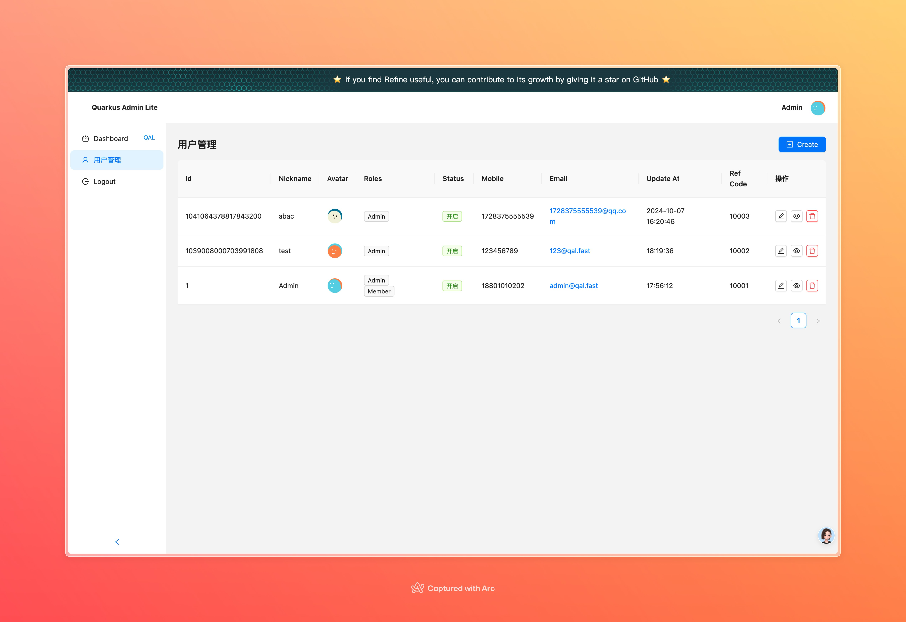
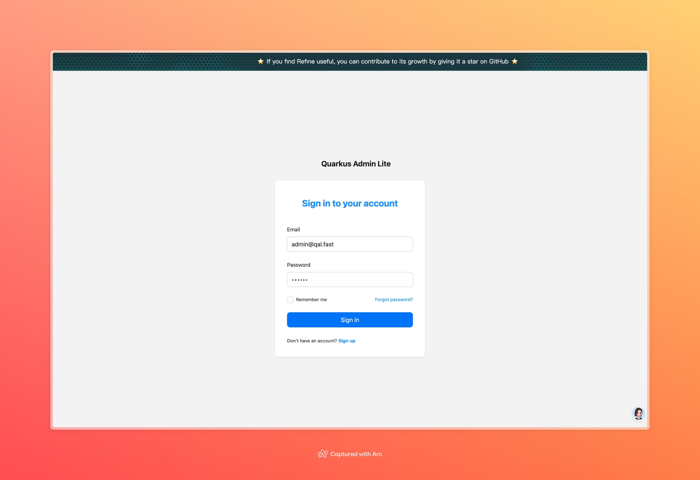
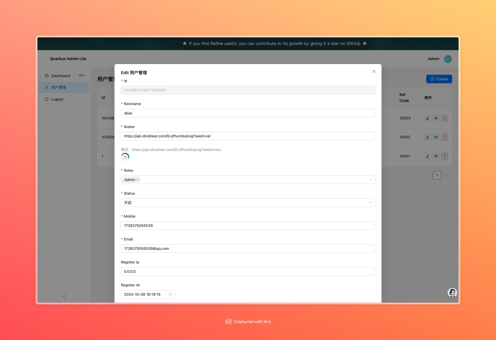
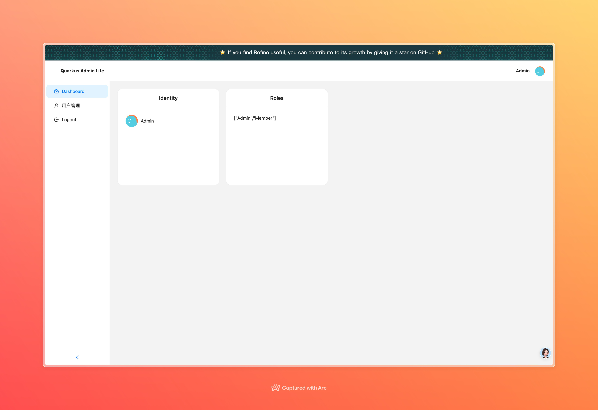

# Quarkus Admin Lite

## 一、项目概述
Quarkus Admin Lite 是一个启动项目即拥有 Admin 和 Api 的高效项目，旨在为小项目提供简单直接的开发方案，同时也适合学习。项目作者水平有限，代码质量可能不高，欢迎提出意见和建议。

## 二、主要特征
1. 启动项目即可获得 Admin 和 Api，简单直接，效率高。
2. 后端采用 jdk21 和 Quarkus，数据层面使用 hibernate+Panache+mapstruct+Jackson，实现简单的数据 CURD 操作，只需创建对应的 Entity，数据库中即自动创建。
3. 前端使用 Refine.dev + React + Antd，入门级 JS 开发者即可上手 React，Refine 框架定义了基本的框架，节省大部分开发时间。

## 三、图片介绍
1. 
2. 
3. 
4. 

## 四、后端开发
### （一）基本环境
- jdk21
- Quarkus

### （二）数据操作
- 使用 hibernate+Panache+mapstruct+Jackson 进行数据 CURD。
- 只需创建对应的 Entity，数据库中即自动创建，如创建`MemberUser`示例：
```java
@Getter
@Setter
@Entity
public class MemberUser extends CustomPanacheEntity {
    /**
    * 用户昵称
    */
    public String nickname;
   ...
}
```
- 数据查询示例：
```java
// select by id
MemberUser entity = MemberUser.findById(id);

// find by email
MemberUser emailMember = MemberUser.find("email", vo.email).firstResult();

// update, 需要在事务方法内 @Transactional
entity.persist();

// other where sql 
MemberUser.find(" xx=?1 ", V1).list()
MemberUser.find(" xx=?1 and xx=?2 ", V1, V2).list()
MemberUser.find(" xx=?1 and xx=?2 ", V1, V2).firstResult()
```

### （三）其他特性
- 使用 mapstruct 进行字段转换，修改后需重新编译。普通代码修改不涉及上下文时，Quarkus 会自动热更新。

## 五、前端开发
- 使用 Refine.dev + React + Antd，入门会写 JS 就可上手 React。Refine 框架定义了基本框架，包括 Login、Curl、路由、结构等，节省大部分时间。只需将 API 对上即可获得数据资源，其他页面资源路径可复制模板套上数据，快速开发功能。但 Refine 的文档需要学习，比较麻烦。（前端教程后续发布）

## 六、TODO
- [ ] Demo 模板案例
- [ ] 部署
- [ ] 权限：菜单权限
- [ ] 定时任务
- [ ] 文件存储 Demo
- [ ] WxPay，AliPay
- [ ] Excel 导出
- [ ] 登录日志
- [ ] 用户前端资源
- [ ] 可以加入小程序/H5 模板
- [ ] 接口传输加密
- [ ] 邮件

## 七、项目开发原因
1. 简单，无脑直接上，对于小项目，没有心智负担，效率高。
2. 学习，此项目适合学习，如果上大项目很多还是需要用正儿八经的，不然很多组件和功能是没有的。
3. 项目作者水平不高，代码质量不高，若有疑问，请及时提出意见。
4. 如果有哪里不规范或者项目结构需要其他功能的，请及时提出意见。